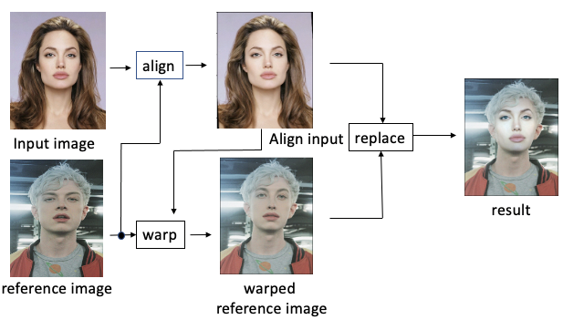
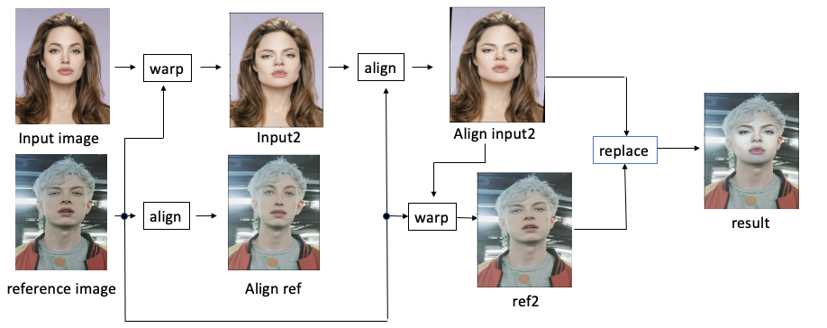
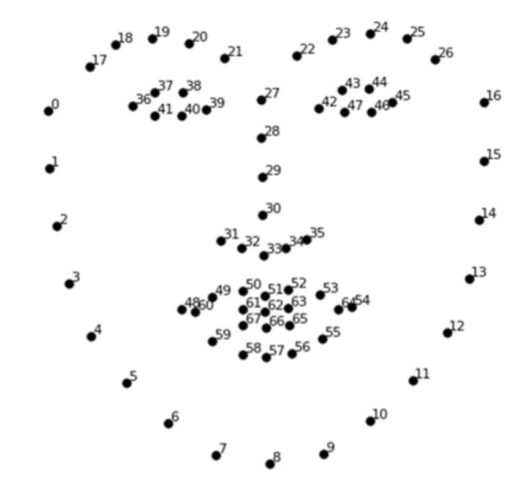
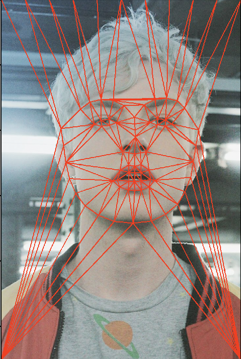

# Face_swap

## How to use it?

from face_swap import face_swap
import os
import matplotlib.pylab as plt

man_path = os.path.join(".", "test_image", "woman.jpg")
woman_path = os.path.join(".", "test_image", "man.jpg")

img = face_swap(man_path, woman_path)

plt.imshow(img)

## Origin algorithm

In paper, the organ algorithm is like this
main idea of the paper is to fit input image and reference image
1. Input image is rotated and moved because two image need to centered for face swapping.(This task named by align, the detail of align is to find center point of reference image and face angle and then input image is rotated as the angle and moved as the center position)

2. Reference image is warped in accordance with align input for matching chin line between input and reference(This task is named by warp)

3. The last task is to find face roi in both and replace faces

## Improving algorithm
In my application, I waned to make image more naturally
my main idea is to fit twice about input and reference image
so, I make "Input2" which is warped in accordance with reference image
and then I make "Align input2" which is aligned by reference, I make "ref2" which is warped in accordance with align input2
finally using "Align input2" and "ref2" I make the result

## warping
I used "Delaunay triangulation" algorithm for making triangles about face area
For this task, i detect landmarks using dlib and apply delaunay triangulation algorithm to the landmarks

The dlib landmark is like this

Following image is triangles in reference image

and other triangles(not face) are partitioned equally

In last, I identified relationship between triangle of input and corresponded triangle of reference
and moved pixels in accordance with the relationship

## Reference
I refer to the paper and sources

paper: https://www.hindawi.com/journals/mpe/2019/8902701/
source: https://github.com/BruceMacD/Face-Swap-OpenCV
    https://pysource.com/2019/05/28/face-swapping-explained-in-8-steps-opencv-with-python/

## Dependency

dlib: http://dlib.net/
face_toolbox_keras: https://github.com/shaoanlu/face_toolbox_keras
